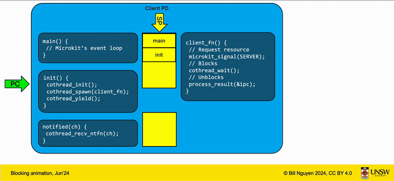

# Client Programming Model for Microkit

## Problem
<!-- Lifted from the ToR project brief -->
The [seL4 Microkit](https://trustworthy.systems/projects/microkit/) prescribes an event-handler programming model, which is appropriate for implementing OS services, as well as for reactive clients, which are common in real-time systems. However, it is not the right model for clients that are not reactive, but are built around a computation for which OS services are incidental.

Such a (more traditional) programming model can be implemented on top of the existing event-oriented model through a library that provides a synchronous API over the asynchronous event handlers.

### Example
In a typical Microkit system with asynchronous I/O, making an I/O request might look like:
```C
void init(void) {
	// Single threaded computation going ... then need something remotely!
	// Pause computation
	// Prepare req in shared memory
	microkit_signal(SERVER_CH);
	// Register in local data structure that a req is in-flight.
	// Cannot do anything until the result come back.
}

void notified(microkit_channel channel) {
	if (channel == SERVER_CH) {
		// Result has landed. Resume computation from where we left off.
	}
}
```

This is sufficient for a reactive event-based system such as a device driver. But is highly inconvenient for a more compute intensive workload where interactions with other PDs are only on an as-needed basis. We cannot spin-wait after signalling as the Microkit event loop will never get runs! 

### Aim
Design, implementation and performance evaluation of a library that provides a non-reactive (active process) programming model on top of the Microkit API.

## Solution
### Terminology
- Protection Domain (PD) thread: user thread created by the seL4 kernel for a protection domain. This is where the Microkit's event loop and entry points runs. For brevity, we will refer to this as "root thread".
- Root TCB: the thread control block of the root thread within this library used to store it's execution context for cothread switching and blocking state.
- Cothread: an execution context in userland that the seL4 kernel is not aware of. The client provides memory for the stack in the form of a Memory Region (MR) with guard page.
- Cothread TCB: serves the same purpose as root TCB, but also stores the virtual address of the cothread's stack.
- Semaphore: a userland object created by the library to manage a queue of cothreads blocking/waiting on an event to happen.
- Protected region: a region of code that cannot execute until an asynchronous I/O operation completes.

### Overview
`libmicrokitco` is a cooperative user-land multithreading library with a FIFO scheduler for use within Microkit. In essence, it allow mapping of multiple cothreads onto one kernel thread of a PD. Then, one or more cothreads can wait/block for a client-defined event to happen, while some cothreads are blocked, another cothread can execute. 

### Programming model
We can prevent a protected region from running before an async I/O request comes back by running all compute on a worker cothread then block it on semaphore(s) when an async I/O request needs to be performed. Then in the root cothread, the Microkit event loop runs which can receive communications from outside and signal the semaphore, unblocking the compute cothread when the async I/O request resolves.

For example:
```C
uintptr_t cmd_queue;
uintptr_t result_queue;

microkit_cothread_sem_t async_io_semaphore;

void compute_worker(void) {
	// Computation going...
	// Uh oh, need something from outside world.
	int request = FS_READ;
	enqueue(cmd_queue, request);
	microkit_signal(SERVER_CH);

	// Compute cothread blocks until semaphore is signaled in root cothread.
	microkit_cothread_semaphore_wait(&async_io_semaphore);

	// Unblocked, computation resumes ergonomically...
}

void init(void) {
	microkit_cothread_init();
	microkit_cothread_spawn(compute_worker);
	microkit_cothread_semaphore_init(&async_io_semaphore)
	microkit_cothread_yield();
}

void notified(microkit_channel channel) {
	if (channel == SERVER_CH) {
		// Result has landed...wake the blocked cothread.
		dequeue(cmd_queue, data);
		microkit_cothread_semaphore_signal(resource_semaphore);
	}

	microkit_cothread_yield();
}
```

This is an animation of a similar system blocking on an incoming notification. The yellow area is the stacks and CPU context (saved registers by ABI), every time the yellow arrow switches area, a world switch (i.e. `co_switch()`) happens. The green arrow is the program counter, when it fades to grey, that thread of execution is suspended.




### Scheduling
All ready cothreads are placed in a queue, the cothread at the front will be resumed by the scheduler when it is invoked. Cothreads should yield judiciously during long running computation to ensure other cothreads are not starved of CPU time.

In cases where the scheduler is invoked and no cothreads are ready, the scheduler will return to the root thread to receive notifications. Thus, systems adopting this library will not be reactive since notifications are only received when all cothreads are blocked.

### Memory model
The library expects a large buffer for it's internal data structures and many small MRs of *equal size* for the individual co-stacks allocated to it. These memory regions must only have read and write permissions. See `microkit_cothread_init()`.

### Architecture support
This library supports AArch64, RISC-V (rv64imac) and x86_64.

> The provided `libco` primitives does support hard-float on RISC-V, but the seL4 Microkit is built with soft-float so this entire library is also soft-float for linking.

### State transition

A thread (root or cothread) is in 1 distinct state at any given point in time, interaction with the library can trigger a state transition as follow:


### Performance
This data shows I/O performance of all possible communications model in Microkit between two separate address spaces. Ran on the Odroid C4 (AArch64) and HiFive Unleashed (RISC-V). The data represent 32 passes of operations after 8 warm up passes.

| Benchmark | AArch64 Mean (cycles) | AArch64 stdev | stdev % of mean | RISC-V64 Mean (cycles) | RISC-V64 stdev | stdev % of mean |
|---|---|---|---|---|---|---|
| Protected Prodecure Call (synchronous model) | 886 | 96.87 | 10.93% | 1287 | 52.69 | 4.09% |
| Round trip (RT) client notify - server notify (async model) | 2447 | 82.14 | 3.36% | 5922 | 137.03 | 2.31% | 
| RT client notify - wait with libco - server notify | 2760 | 173.64 | 6.29% | 6222 | 125.80 | 2.02% |  
| RT client notify - wait with libmicrokitco semaphore - server notify | 2880 | 165.84 | 5.76% | 6460 | 155.50 | 2.41% | 


We observe that usage of this library to perform synchronous I/O over an asynchronous interface in Microkit incur a 433 cycles penalty on AArch64 compared to using the native asynchronous Microkit APIs and 120 cycles compared to using bare coroutine primitives to achieve blocking I/O.

This is the cost of emulating synchronous I/O with coroutines and managing the state of said coroutines (which coroutines are blocking on what channel).

Note: Significant slow-down in RISC-V is due to signal fastpath not implemented in seL4 and no ASID.

## Usage
### Prerequisite
You have two choices of toolchain: LLVM clang or GCC.

For LLVM clang, you need the LLVM toolchain installed and on your machine's `$PATH`:
- `clang`,
- `ld.lld`, and 
- `llvm-objcopy` (for x86_64 targets only).

Then define `LLVM = 1` in your Makefile and export it when you invoke libmicrokitco's Makefile.

These `clang` targets have been well tested with this library:
- `aarch64-none-elf`,
- `x86_64-none-elf`,
- `riscv64-none-elf`.

---

For GCC, define `TOOLCHAIN` in your Makefile. You also need them on your `$PATH`:
- `$(TOOLCHAIN)-gcc`,
- `$(TOOLCHAIN)-ld`,
- `$(TOOLCHAIN)-objcopy` (for x86_64 targets only),

If they are not in your `$PATH`, `$(TOOLCHAIN)` must contain the absolute path to them.

These compiler triples have been well tested with this library:
- `aarch64-unknown-linux-gnu`,
- `aarch64-linux-gnu`,
- `aarch64-none-elf`,
- `x86_64-elf`,
- `riscv64-unknown-elf`.

### Configuration
You need to create a file called `libmicrokitco_opts.h` that specify this constant:
1. `LIBMICROKITCO_MAX_COTHREADS`: the number of cothreads your system have, including the root PD thread. For example, if you have the root PD thread and a worker cothread, this must be defined as 2.

`libmicrokitco_opts.h` is tracked as a dependancy of the library's object file. Changes to `libmicrokitco_opts.h` will trigger a recompilation of the library. 

### Compilation
To use `libmicrokitco` in your project, define these in your Makefile:
1. `LIBMICROKITCO_PATH`: absolute path to root of this library,
2. `MICROKIT_SDK`: absolute path to Microkit SDK,
3. `TARGET`: triple, e.g. `aarch64-none-elf`, `x86_64-none-elf`, `riscv64-none-elf`. This is used for naming the output object files and as an argument to LLVM's `clang`.
4. `BUILD_DIR`,
5. `BOARD`: one of Microkit's supported board, e.g. `odroid_c4` or `x86_64_virt`,
6. `MICROKIT_CONFIG`: one of `debug`, `release` or `benchmark`, 
7. `CPU`: one of Microkit's supported CPU, e.g. `cortex-a53`, `nehalem`, or `medany`, 
8. `LIBMICROKITCO_OPT_PATH`: path to directory containing `libmicrokitco_opts.h`. 
9. (Optionally) `LIBCO_PATH`: to coroutine primitives implementation, if not defined, default to the bundled `libco`,
10. The variables as outlined in Prerequisite.

The compiled object filename will have the form:
```Make
LIBMICROKITCO_OBJ := libmicrokitco.a
```

Then, export those variables and invoke `libmicrokitco`'s Makefile. You could also compile many configurations at once, for example with LLVM:
```Make
TARGET=aarch64-none-elf
LIBMICROKITCO_PATH := ../../
LIBMICROKITCO_OPT_PATH := $(shell pwd)
LIBMICROKITCO_OBJ := $(BUILD_DIR)/libmicrokitco/libmicrokitco_aarch64-none-elf.a

LLVM = 1
export LIBMICROKITCO_PATH LIBMICROKITCO_OPT_PATH TARGET MICROKIT_SDK BUILD_DIR MICROKIT_BOARD MICROKIT_CONFIG CPU LLVM

$(LIBMICROKITCO_OBJ):
	make -f $(LIBMICROKITCO_PATH)/Makefile
```

Or with GCC:
```Make
TARGET=aarch64-none-elf
TOOLCHAIN=$(TARGET)
LIBMICROKITCO_PATH := ../../
LIBMICROKITCO_OPT_PATH := $(shell pwd)
LIBMICROKITCO_OBJ := $(BUILD_DIR)/libmicrokitco/libmicrokitco_aarch64-none-elf.a

export LIBMICROKITCO_PATH TARGET MICROKIT_SDK BUILD_DIR MICROKIT_BOARD MICROKIT_CONFIG CPU TOOLCHAIN

$(LIBMICROKITCO_OBJ):
	make -f $(LIBMICROKITCO_PATH)/Makefile
```

Finally, for any of your object files that uses this library, link it against `$(LIBMICROKITCO_OBJ)`.


## Foot guns
- If you perform a protected procedure call (PPC), all cothreads in your PD will be blocked even if they are ready until the PPC returns.
- The only time that your PD can receive notifications is when all cothreads are blocked and the scheduler is invoked, then the execution is switched to the root thread where the Microkit event loop runs to receive and dispatch notifications/PPCs. Consequently, if there is a long running cothread that never blocks, the other cothreads will never wake up if they are blocked on some channel.
- If you have 2 or more cothreads and they use `signal_delayed()`, the previous cothread's signal will get overwritten!


## API
---

### `void microkit_cothread_init(co_control_t *controller_memory_addr, const size_t co_stack_size, ...)`
A variadic function that initialises the library's internal data structure. Each protection domain can only have one "instance" of the library running.

##### Arguments
- `controller_memory_addr` points to the base of a buffer/MR that is at least `LIBMICROKITCO_CONTROLLER_SIZE` bytes large.
- `co_stack_size` to be >= 0x1000 bytes.

Then, it expect `LIBMICROKITCO_MAX_COTHREADS` (defined at compile time) of `uintptr_t` that point to where each co-stack starts. Giving less than `LIBMICROKITCO_MAX_COTHREADS` is undefined behaviour!

---

### `bool microkit_cothread_free_handle_available(microkit_cothread_ref_t *ret_handle)`
Returns a flag whether the cothreads pool has been exhausted. If the pool has not been exhausted, returns the handle number of the next available cothread. This invariant is guaranteed to be true if you call `spawn()` before any cothread returns or other `libmicrokitco` functions are invoked.
##### Arguments
- `*ret_handle` points to a variable in the caller's stack to write the next available handle to.

---

### `microkit_cothread_ref_t microkit_cothread_spawn(const client_entry_t client_entry, void *private_arg)`
A variadic function that creates a new cothread then place it into the scheduling queue, but does not switch to it.

A handle is an integer that is allocated in FIFO order. The first cothread created in a PD is guaranteed to have a handle number 1.

When `client_entry` returns, the cothread handle will be released back into the cothreads pool.

This functions returns a handle to the created cothread, but returns `LIBMICROKITCO_NULL_HANDLE` when the cothreads pool has been exhausted.

##### Arguments
- `client_entry` points to your cothread's entrypoint function of the form `void (*)(void)`.
- `private_arg` an argument into the newly spawned cothread that can later be retrieved within it's context with `my_arg()`.

---

### `void microkit_cothread_set_arg(const microkit_cothread_ref_t cothread, void *private_arg)`
Set the private argument of the given cothread handle which must be currently active.

##### Arguments
- `cothread` is the subject cothread handle.
- `private_arg` is the argument being set.

--- 

### `co_state_t microkit_cothread_query_state(const microkit_cothread_ref_t cothread);`
Returns the state of the given cothread handle.
##### Arguments
- `cothread` is the subject cothread handle.

---

### `microkit_cothread_ref_t microkit_cothread_my_handle(void)`
Returns the calling cothread's handle.

---

### `void *microkit_cothread_my_arg(void)`
Return the private argument of the calling cothread that was set from `spawn()` or `set_arg()`, returns error if called from the root thread.

--- 

### `void microkit_cothread_yield(void)`

Yield the kernel thread to another cothread and place the caller at the back of the scheduling queue. If there are no other ready cothreads, the caller cothread keeps running.

---

### `void microkit_cothread_destroy(const microkit_cothread_ref_t cothread)`
Destroy the given cothread. Internally, the subject cothread's handle is released back into the cothreads pool and such handle is non-scheduleable until it is returned from a `spawn()` call.

If the caller destroy itself, the scheduler will be invoked to pick the next cothread to run.

**However, destroying a cothread whose state is blocked is undefined behaviour.**

##### Arguments
- `cothread` is the subject cothread handle.

---

### `void microkit_cothread_semaphore_init(microkit_cothread_sem_t *ret_sem)`
Initialise a user-land blocking semaphore at the given memory address with an empty queue and false signalled flag.

##### Arguments
- `ret_sem` is the memory address to write the new

---

### `void microkit_cothread_semaphore_wait(microkit_cothread_sem_t *sem)`
If the signalled flag of the semaphore is true, set it to false and return immediately.

Otherwise, block the calling cothread on the given semaphore and enqueue it into the semaphore's waiting queue.

Internally, the state of the calling cothread is updated to blocked (i.e. non-schedulable) then the CPU thread is yielded to another cothread.

##### Arguments
- `sem` to block on.

---

### `void microkit_cothread_semaphore_signal(microkit_cothread_sem_t *sem)`
Unblock 1 cothread at the head of this semaphore's waiting queue and switch to it. If there is no cothread blocked on this semaphore, the signalled flag is set to true.

Internally, the state of the calling cothread is updated to ready and the calling cothread is enqueued back into the scheduling queue. Then the state of the blocked cothread is updated to running and control is switched to it.

##### Arguments
- `sem` to signal.

---

### `inline bool microkit_cothread_semaphore_is_queue_empty(const microkit_cothread_sem_t *sem)`
Returns whether the waiting queue of the given semaphore is empty.

##### Arguments
- `sem` to check.

---

### `inline bool microkit_cothread_semaphore_is_set(const microkit_cothread_sem_t *sem)`
Returns whether the flag of the semaphore is set.

That is, whether a `signal()` has happened before anyone `wait()`'ed on this semaphore.

##### Arguments
- `sem` to check.

---

### `void microkit_cothread_wait_on_channel(const microkit_channel wake_on)`
A convenient thin wrapper of `semaphore_wait()` for waiting on Microkit channel.

Internally, an array maps each Microkit channel into a semaphore that can be used to block/unblock the calling cothread on notification from a channel.

---

### `void microkit_cothread_recv_ntfn(const microkit_channel ch)`
A convenient thin wrapper of `semaphore_signal()` for unblocking a cothread waiting on Microkit channel.

Call this in your `notified()` if you have cothreads blocked with `wait_on_channel()`.
