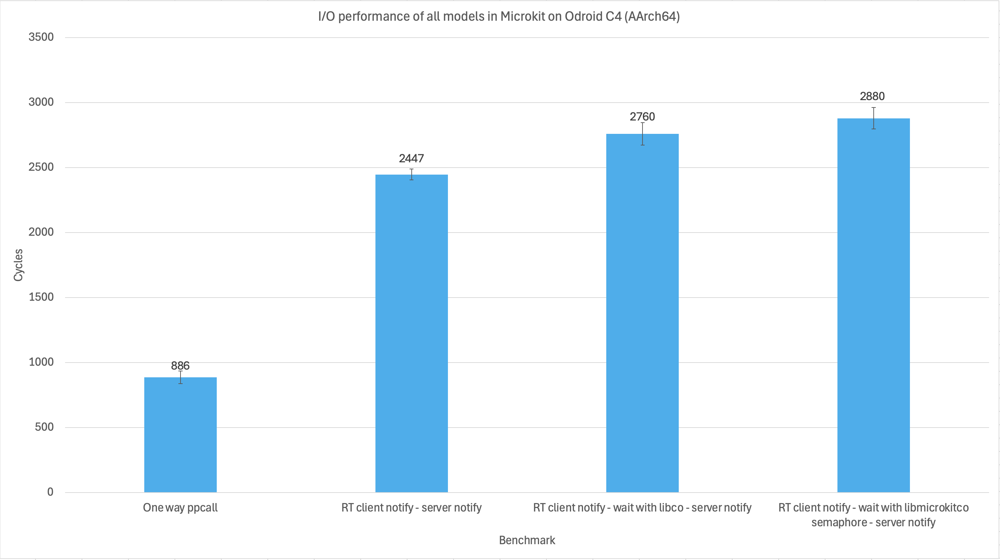
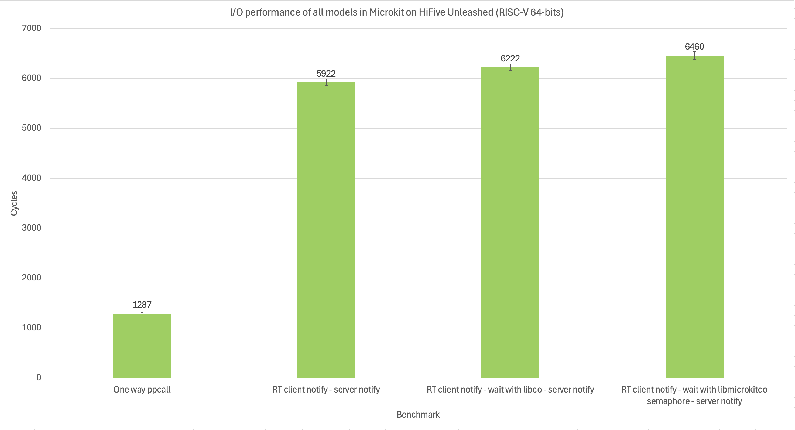

# Client Programming Model for Microkit

## Problem
<!-- Lifted from the ToR project brief -->
The [seL4 Microkit](https://trustworthy.systems/projects/microkit/) prescribes an event-handler programming model, which is appropriate for implementing OS services, as well as for reactive clients, which are common in real-time systems. However, it is not the right model for clients that are not reactive, but are built around a computation for which OS services are incidental.

Such a (more traditional) programming model can be implemented on top of the existing event-oriented model through a library that provides a synchronous API over the asynchronous event handlers.

## Aim
Design, implementation and performance evaluation of a library that provides a non-reactive (active process) programming model on top of the Microkit API.

## Solution
### Terminology
- Protection Domain (PD) thread: user thread created by the seL4 kernel for a protection domain. This is where the Microkit's event loop and entry points runs. For brevity, we will refer to this as "root thread".
- Root TCB: the thread control block of the root thread within this library used to store it's execution context for cothread switching and blocking state.
- Cothread: an execution context in userland that the seL4 kernel is not aware of. The client provides memory for the stack in the form of a Memory Region (MR) with guard page.
- Cothread TCB: serves the same purpose as root TCB, but also stores the virtual address of the cothread's stack.


### Overview
`libmicrokitco` is a cooperative user-land multithreading library with a FIFO scheduler for use within Microkit. In essence, it allow mapping of multiple cothreads onto one kernel thread of a PD. Then, one or more cothreads can wait/block for an incoming notification from a channel or another cothread to return or a user-defined event, while some cothreads are blocked, another cothread can execute. 

### Scheduling
All ready cothreads are placed in a queue, the cothread at the front will be resumed by the scheduler when it is invoked. Cothreads should yield judiciously during long running computation to ensure other cothreads are not starved of CPU time.

In cases where the scheduler is invoked and no cothreads are ready, the scheduler will return to the root thread to receive notifications, see `microkit_cothread_recv_ntfn()`. Thus, systems adopting this library will not be reactive since notifications are only received when all cothreads are blocked.

### Receiving notifications fastpath
When `microkit_cothread_recv_ntfn()` receives a notification and only 1 cothread is blocked on that channel, it will enter a fastpath that directly unblock the cothread, bypassing the scheduling queue to save time.

This fastpath can be disabled through a preprocessor directive, but you should not need to do so under normal circumstances, unless you are benchmarking.

### Memory model
The library expects a large buffer for it's internal data structures and many small MRs of *equal size* for the individual co-stacks allocated to it. These memory regions must only have read and write permissions. See `microkit_cothread_init()`.

### Architecture support
This library supports AArch64, RISC-V (rv64imac) and x86_64.

> The provided `libco` primitives does support hard-float on RISC-V, but the seL4 Microkit is built with soft-float so this entire library is also soft-float for linking.

### State transition

A thread (root or cothread) is in 1 distinct state at any given point in time, interaction with the library or external incoming notifications can trigger a state transition as follow:


### Visualisation of execution

This is an animation of a PD blocking on an incoming notification. The yellow area is the stacks and CPU context (saved registers by ABI), every time the yellow arrow switches area, a world switch (i.e. `co_switch()`) happens. The green arrow is the program counter, when it fades to grey, that thread of execution is suspended.


### Pre-emptive unblocking
Is an opt-in feature that allow incoming notifications from all channels to be queued, signifying that a shared resource is ready before a cothread blocks on it. There can only be a maximum of 1 queued notification per channel, if any more notifications come in and there is already a queued notification on that channel, they will be ignored. If a cothread blocks on a channel with a queued notification, that cothread is unblocked immediately with no state transition.

### Performance
This data shows I/O performance of all possible communications model in Microkit between two separate address spaces compared to blocking with `libmicrokitco`. Ran on the Odroid C4 (AArch64) and HiFive Unleashed (RISC-V). The data represent 32 passes of operations after 8 warm up passes.

| Benchmark | AArch64 Mean (cycles) | AArch64 stdev | stdev % of mean | RISC-V64 Mean (cycles) | RISC-V64 stdev | stdev % of mean |
|---|---|---|---|---|---|---|
| One way Protected Prodecure Call (PPC) | 392 | 38.47 | 9.81% | 549 | 31.22 | 5.69% |
| Round trip (RT) PPC | 853 | 52.73 | 6.18% | 1272 | 35.31 | 2.78% | 
| RT client notify - server notify (async model) | 2448 | 75.81 | 3.10% | 5931 | 129.52 | 2.18% | 
| RT client notify - wait with libco - server notify | 2723 | 124.15 | 4.56% | 6322 | 128.31 | 2.03% |  
| RT client notify - wait with libmicrokitco in fastpath - server notify | 2864 | 191.18 | 6.68% | 7135 | 166.52 | 2.33% | 
| RT client notify - wait with libmicrokitco in slowpath - server notify | 2980 | 139.07 | 4.67% | 7254 | 132.76 | 1.83% | 




We observe that usage of this library to perform synchronous I/O over an asynchronous interface in Microkit incur a ~400 cycles penalty on AArch64 compared to using the native asynchronous Microkit APIs and ~150 cycles compared to using bare coroutine primitives to achieve blocking I/O.

This is the cost of emulating synchronous I/O with coroutines and managing the state of said coroutines (which coroutines are blocking on what channel).

Note: Significant slow-down in RISC-V is due to signal fastpath not implemented and no ASID.

## Usage
### Prerequisite
You have two choices of toolchain: LLVM clang or GCC.

For LLVM clang, you need the LLVM toolchain installed and on your machine's `$PATH`:
- `clang`,
- `ld.lld`, and 
- `llvm-objcopy` (for x86_64 targets only).

Then define `LLVM = 1` in your Makefile and export it when you invoke libmicrokitco's Makefile.

These `clang` targets have been well tested with this library:
- `aarch64-none-elf`,
- `x86_64-none-elf`,
- `riscv64-none-elf`.

---

For GCC, define `TOOLCHAIN` in your Makefile. You also need them on your `$PATH`:
- `$(TOOLCHAIN)-gcc`,
- `$(TOOLCHAIN)-ld`,
- `$(TOOLCHAIN)-objcopy` (for x86_64 targets only),

If they are not in your `$PATH`, `$(TOOLCHAIN)` must contain the absolute path to them.

These compiler triples have been well tested with this library:
- `aarch64-unknown-linux-gnu`,
- `aarch64-linux-gnu`,
- `aarch64-none-elf`,
- `x86_64-elf`,
- `riscv64-unknown-elf`.

### Configuration
You need to create a file called `libmicrokitco_opts.h` that specify this constant:
1. `LIBMICROKITCO_MAX_COTHREADS`: the number of cothreads your system needs.

Optionally, you can specify these constants to opt-in to/out of features as appropriate for your need:
1. `LIBMICROKITCO_PREEMPTIVE_UNBLOCK`,
2. `LIBMICROKITCO_RECV_NTFN_NO_FASTPATH`,
3. `LIBMICROKITCO_UNSAFE`: disable most error checking for fastest performance. Don't use unless you really know what you are doing.

`libmicrokitco_opts.h` is tracked as a dependancy of the library's object file. Changes to `libmicrokitco_opts.h` will trigger a recompilation of the library. 

### Compilation
To use `libmicrokitco` in your project, define these in your Makefile:
1. `LIBMICROKITCO_PATH`: absolute path to root of this library,
2. `MICROKIT_SDK`: absolute path to Microkit SDK,
3. `TARGET`: triple, e.g. `aarch64-none-elf`, `x86_64-none-elf`, `riscv64-none-elf`. This is used for naming the output object files and as an argument to LLVM's `clang`.
4. `BUILD_DIR`,
5. `BOARD`: one of Microkit's supported board, e.g. `odroid_c4` or `x86_64_virt`,
6. `MICROKIT_CONFIG`: one of `debug`, `release` or `benchmark`, 
7. `CPU`: one of Microkit's supported CPU, e.g. `cortex-a53`, `nehalem`, or `medany`, 
8. `LIBMICROKITCO_OPT_PATH`: path to directory containing `libmicrokitco_opts.h`. 
9. (Optionally) `LIBCO_PATH`: to coroutine primitives implementation, if not defined, default to the bundled `libco`,
10. The variables as outlined in Prerequisite.

The compiled object filename will have the form:
```Make
LIBMICROKITCO_OBJ := libmicrokitco_$(TARGET).o
```
For example, the library object file built for AArch64 would have the name:
```Make
libmicrokitco_aarch64-none-elf.o
```

Then, export those variables and invoke `libmicrokitco`'s Makefile. You could also compile many configurations at once, for example with LLVM:
```Make
TARGET=aarch64-none-elf
LIBMICROKITCO_PATH := ../../
LIBMICROKITCO_OPT_PATH := $(shell pwd)
LIBMICROKITCO_OBJ := $(BUILD_DIR)/libmicrokitco/libmicrokitco_aarch64-none-elf.o

LLVM = 1
export LIBMICROKITCO_PATH LIBMICROKITCO_OPT_PATH TARGET MICROKIT_SDK BUILD_DIR MICROKIT_BOARD MICROKIT_CONFIG CPU LLVM

$(LIBMICROKITCO_OBJ):
	make -f $(LIBMICROKITCO_PATH)/Makefile
```

Or with GCC:
```Make
TARGET=aarch64-none-elf
TOOLCHAIN=$(TARGET)
LIBMICROKITCO_PATH := ../../
LIBMICROKITCO_OPT_PATH := $(shell pwd)
LIBMICROKITCO_OBJ := $(BUILD_DIR)/libmicrokitco/libmicrokitco_aarch64-none-elf.o

export LIBMICROKITCO_PATH TARGET MICROKIT_SDK BUILD_DIR MICROKIT_BOARD MICROKIT_CONFIG CPU TOOLCHAIN

$(LIBMICROKITCO_OBJ):
	make -f $(LIBMICROKITCO_PATH)/Makefile
```

Finally, for any of your object files that uses this library, link it against `$(LIBMICROKITCO_OBJ)`.


## Foot guns
- If you perform a protected procedure call (PPC), all cothreads in your PD will be blocked even if they are ready until the PPC returns.
- The only time that your PD can receive notifications is when all cothreads are blocked and the scheduler is invoked, then the execution is switched to the root thread where the Microkit event loop runs to receive and dispatch notifications/PPCs. Consequently, if there is a long running cothread that never blocks, the other cothreads will never wake up if they are blocked on some channel.
- If you have 2 or more cothreads and they use `signal_delayed()`, the previous cothread's signal will get overwritten!


## API
### `const char *microkit_cothread_pretty_error(const co_err_t err_num)`
Map the error number returned by this library's functions into a human friendly error message string.

---

### `co_err_t microkit_cothread_init(const uintptr_t controller_memory_addr, const size_t co_stack_size, ...)`
A variadic function that initialises the library's internal data structure. Each protection domain can only have one "instance" of the library running.

##### Arguments
- `controller_memory_addr` points to the base of a buffer/MR that is at least `LIBMICROKITCO_CONTROLLER_SIZE` bytes large.
- `co_stack_size` to be >= 0x1000 bytes.

Then, it expect `LIBMICROKITCO_MAX_COTHREADS` (defined at compile time) of `uintptr_t` that point to where each co-stack starts. Giving less than `LIBMICROKITCO_MAX_COTHREADS` is undefined behaviour!

---

### `co_err_t microkit_cothread_spawn(const client_entry_t client_entry, const bool ready, microkit_cothread_t *handle_ret, uintptr_t private_arg)`
A variadic function that creates a new cothread, but does not switch to it.

##### Arguments
- `client_entry` points to your cothread's entrypoint function of the form `void (*)(void)`.
- `ready` indicates whether to schedule your cothread for execution. If you pass `true`, the thread will be placed into the scheduling queue for execution when the calling thread yields or blocks. If you pass `false`, you must later call `mark_ready()` for this cothread to be scheduled.
- `*handle_ret` points to a variable in the caller's stack to write the new cothread's handle to.
- `private_arg` an argument into the newly spawned cothread that can later be retrieved within it's context with `get_arg()`.

--- 

### `co_err_t microkit_cothread_query_state(const microkit_cothread_t cothread, co_state_t *ret_state);`
Returns the state of the given cothread handle.
##### Arguments
- `cothread` is the subject cothread handle.
- `*ret_state` points to a variable in the caller's stack to write the state to.

---

### `co_err_t microkit_cothread_free_handle_available(bool *ret_flag)`
Returns whether the cothreads pool has been exhausted.
##### Arguments
- `*ret_flag` points to a variable in the caller's stack to write the flag to.

---

### `co_err_t microkit_cothread_my_handle(microkit_cothread_t *ret_handle)`
Returns the calling cothread's handle.
##### Arguments
- `*ret_handle` points to a variable in the caller's stack to write the handle to.

---

### `co_err_t microkit_cothread_my_arg(uintptr_t *ret_priv_arg)`
Fetch the private argument of the calling cothread that was set from `spawn()`, returns error if called from the root thread.

##### Arguments
- `*ret_priv_arg` points to a variable in the caller's stack to write the argument to.

---

### `co_err_t microkit_cothread_mark_ready(const microkit_cothread_t cothread)`
Marks an initialised but not ready cothread as ready and schedule it, but does not switch to it.

##### Arguments
- `cothread` is the subject cothread handle.

---

### `co_err_t microkit_cothread_recv_ntfn(const microkit_channel ch)`
Maps an incoming notification to blocked cothreads, schedule them then yields to let the newly ready cothreads execute. **Call this in your `notified()` if you have cothreads blocking on channel**, otherwise, co-threads will never wake up if they blocks.

This will always runs in the context of the root PD thread.

##### Arguments
- `ch` number that the notification came from.

--- 

### `void microkit_cothread_yield()`

Yield the kernel thread to another cothread and place the caller at the back of the scheduling queue. If there are no other ready cothreads, the caller cothread keeps running.

---

### `co_err_t microkit_cothread_wait_on_channel(const microkit_channel wake_on)`
Blocks the calling cothread on a notification of a specific Microkit channel then yield. If there are no other ready cothreads, control is switched to the root PD thread for receiving notifications. Many cothreads can block on the same channel.

##### Arguments
- `wake_on` channel number. Make sure this channel is known to the PD, otherwise, the calling cothreads will block forever.

---

### `microkit_cothread_block()`
Blocks the calling cothread then yield. If there are no other ready cothreads, control is switched to the root PD thread. Upon a user-defined event, the blocked cothread can be woken up with `mark_ready()`.

---

### `co_err_t microkit_cothread_destroy(const microkit_cothread_t cothread)`
Destroy a specific cothread regardless of their running state, then return it's resources back into the cothreads pool. Should be sparingly used because cothread might hold resources that needs free'ing.

If the caller destroy itself, the scheduler will be invoked to pick the next cothread to run.

##### Arguments
- `cothread` is the subject cothread handle.

---

### `co_err_t microkit_cothread_join(const microkit_cothread_t cothread, size_t *retval)`
Blocks the caller until the #`cothread` thread returns, then write it's return value to `retval`. This API is able to detect simple deadlock scenario such as #1 joins #2, #2 joins #3 then #3 joins #1. A thread cannot join itself. 

Take special care when joining in the root PD thread as you will not be able to receive notifications from seL4.

##### Arguments
- `cothread` is the subject cothread handle.
- `retval` points to a variable on the caller's stack to write the cothread return value to.
